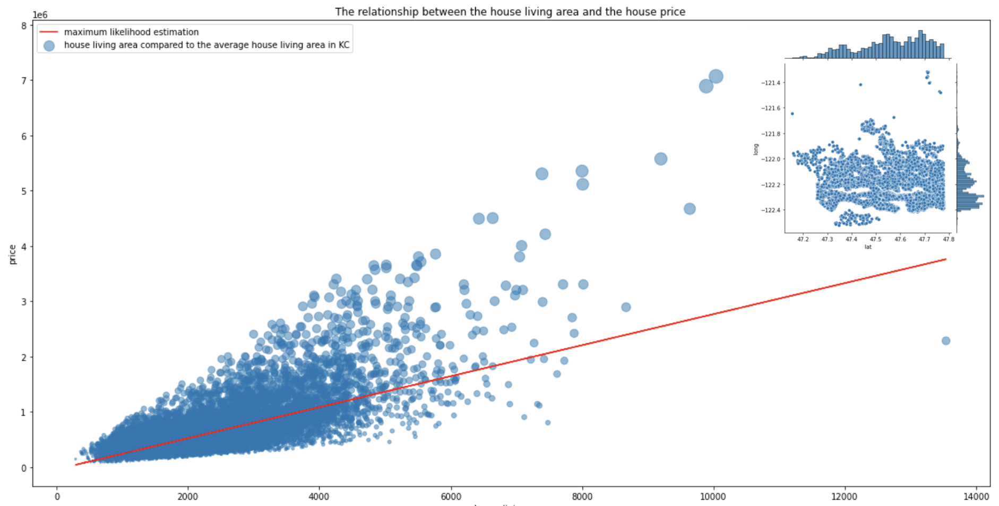
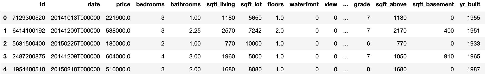
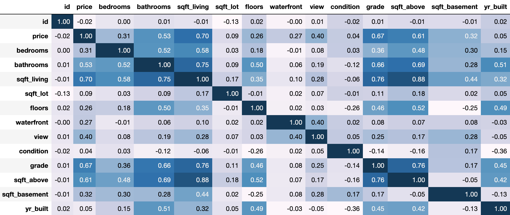

## The key factor impacts the house price in Kansas City

> Github: https://github.com/623059008/InfoVizProject
>
> Author: Tempest

### Main Figure

### Figure Explanation

The top right small figure shows the geographic distribution of houses in KC. X-axis shows latitude and Y-axis shows longitude. Each point in this scatter represents a house. 

The main figure shows the correlation between house living area and house price in KC. X-axis is the house living area and Y-axis is the price of the houses. On the left top corner, there is the legend of this figure. Each blue point represents a house and the size of the point represents the ratio of the house living area to the average house living area.

The red line represents the maximum likelihood estimation for house price to house area.

### Findings

It shows housing prices are **positively correlated** with the house living area. 

Using **linear regression**, it shows how the typical positive correlation is between house price and house living area.

There are also some acceptable abnormal points. Besides, the amount of houses with low price and small area is majority compared to the amount of houses with higher price and larger area.

### DataSet

[Kansas City_house_data.csv](./kc_house_data.csv)

This dataset downloads from Kaggle.

In this dataset, there are date, price, bedrooms, bathrooms, sqft_living, sqft_lot, floors, waterfront, view, sqft_basement, sqft_above, building year, renovated year, lat and long, zipcode.

### Method

- Firstly, I made some **assumptions** to explore the correlation between house price and other factors.

- Then I draw the **scatter figures** of house price and living area, lot area, longitude, amout of bedrooms, year built and year renovated. 
  - After reviewing all of these figures, I found most of these factors are not directly correlative with the house price except living area.

- Then I use **linear regression** model to show this positive correlation to validate my assumption.
- Finally, I finish the conclusion: housing prices are **positively correlated** with the house living area.

### Importance

This topic is very important because it helps us find a more cost-effective house in KC. According to above conclusion, we need to consider the living area as main factor to choose our target house and other factors do not inapparently increase the price which means all these inapparent factors can be set as optimal.

